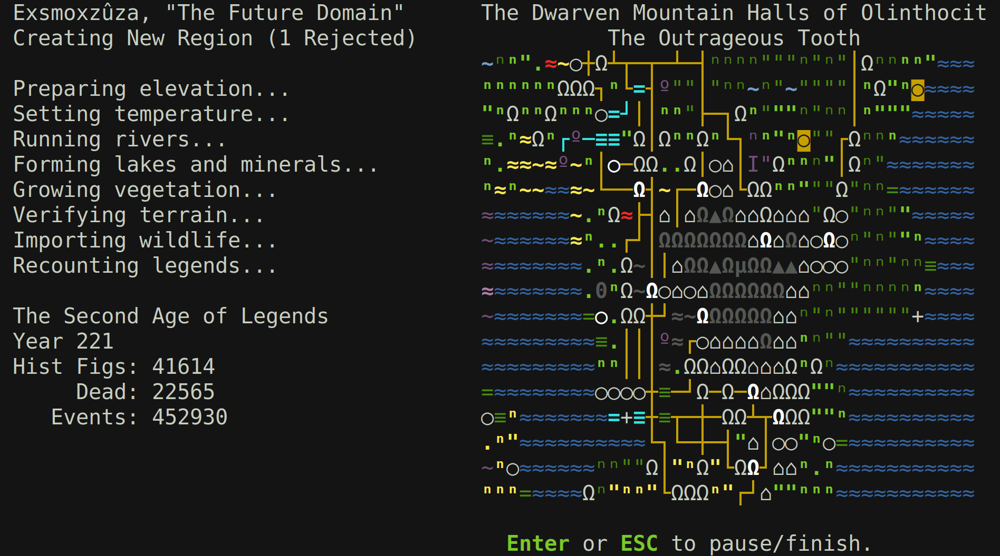
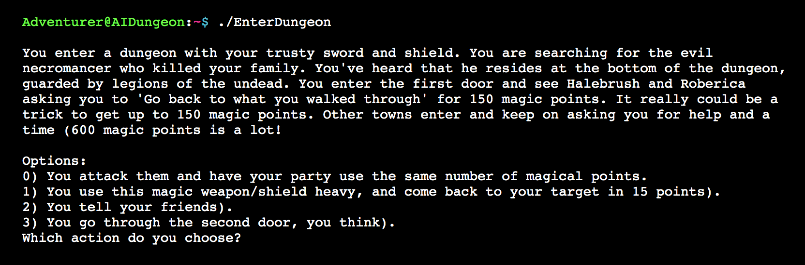

# Horror stories played by: The Horror German Dude's Game Treatment Document
> A game by Augusto Felipe Hornburg, Gustavo Spiess and Matheus Klauberg

## Horror stories played by: The Horror German Dude

Follow in the footsteps of a person through a engaging and exciting story, discovering new ambients, solving puzzles, obtaining items and interacting with the world around you to continue in your path, with the goal of reach and learn horrors beyond human imagination.

## Executive Summary

* Multiple stories;
* Ease of play;
* Short game lenght;
* High replayability;
* High shareability of fun and intriguing moments during runs;

# Overview

## High Concept

Follow in the footsteps of a person through a engaging and exciting story, discovering new ambients, solving puzzles, obtaining items and interacting with the world around you to continue in your path, with the goal of reach and learn horrors beyond human imagination.

The game is a text base homage to classical suspense and terror games. In addition, it will have the bonus of a procedural generated story, giving plenty of opportunities to the player to get surprised, as new story plots are discovered by the player in each playthrough.

The game interface is simple allowing for a very low learning curve to new players.

## Genre

The game is a text based adventure with puzzle and rogue-like elements, similar to games like (The Dreamhold)[https://zarfhome.com/dreamhold/], (Zork)[http://textadventures.co.uk/games/view/5zyoqrsugeopel3ffhz_vq/zork] and (Spider and Web)[https://www.eblong.com/zarf/zweb/tangle/]. And also suspense filled games like (The Last Door)[https://thegamekitchen.com/thelastdoor/] and (Darkwood)[https://www.darkwoodgame.com].

## Hooks

* Multiple stories to be played;
* Lovecraftian like stories;
* Easy to be played, even to people that aren't used to playing games;

## License

The game does not need any license, as the characters are original.

## Gameplay Highlights

* Text based adventure game;
* Each game run has a different story;
* High replayability;
* Puzzles;

## Technology Highlights

The game engine will be developed using Python3 with the tracery library.

The graphical interface will be developed using web technologies, such as JavaScript, using the React UI library, using Web APIs such as Web Audio API to play sounds during the story.

## Audio Highlights

During some story moments, a eerie sound will play to help the player get acclimated to the story.

The sounds will change to not be repetetive, but will follow the same theme.

## Art Highlights

As the game consists of a collection of stories, the art displayed will follow a conceptual theme to help immerse the player in the story.

## Hardware

Computers or cellphones with access to a web browser.

# Production Details

## Budget

This is a college project, so all of the invested time is not going to cost anything.

## Schedule

* 3 months of development;
* 1 month to develop the interaction between the player and the story engine;
* 1 month to develop the UI to show the story, play sounds and show story related image assets;
* 1 month of tests and final changes;

## Competition

### Dwarf Fortress

Dwarf Fortress is a construction and management simulation and roguelike indie video game created by Bay 12 Games. Freeware and in development since 2002, its first alpha version was released in 2006 and it received attention for being a two-member project surviving solely on donations.

### AI Dungeon

AI Dungeon is a free-to-play single-player and multiplayer text adventure game which uses artificial intelligence to generate unlimited content. It also allows players to create and share their own custom adventure settings. The game's first version was made available on Colab in May 2019, and its second version (initially called AI Dungeon 2) was released online and for iOS & Android in December 2019. The AI model was then upgraded in July 2020.

# Game World

## Backstory

* Each story has a different backstory;
* Stories have a Lovecraftian like background with horror and terror elements;

## Objective

* Finish the given story. To finish the story the player will have to traverse through different ambients, interacting the the ambient objects to solve puzzles and reveal new story chunks.

## Characters

### The player

A character that follows in the footstep of the **co-protagonist**.

The player is named **Hans**, a private investigator.

The character traits change based on the story being played, as each story is different and consig of different reasons to try and reach its end.

### Co-Protagonist

This character already went through the story, and changed the story by their actions, changing the story ambients, leaving clues behind to help the **Hans** with puzzles.

This character is not named or have traits, as the person that goes before the player changes with each story, making this character have different personalities, such as of a professor, researcher and even a family connection with **Hans**.

## Progress

* Before the game starts, the player is shown a text explaing the story, and how to interact with the story through the game interface;
* The game starts in the story ambient;
* The player must intereact with the ambient objects to solve a puzzle, solving the puzzle allows the player to navigate to a different ambient;
* As the player traverses through ambients, he's going to lear more about the story by using clues left behind by the co-protagonist
